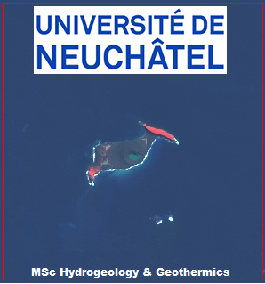
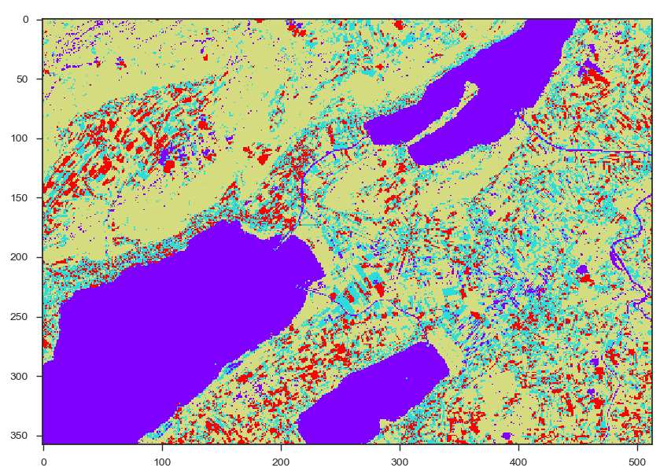

# Files for the REMOTE SENSING course 
MSc in Hydrogeology and Geothermics, 
Université de Neuchâtel), Spring 2019

Author: Landon Halloran (www.ljsh.ca)

## Info:
The files in this repository are demos seen in class (Days 1 and 2) and tutorials/exercises (Days 3 and 4). 
- `.js` files are _javascript_ files. You can simply cut and paste them into the Script editor at https://code.earthengine.google.com/ (once you've signed up).
- `.py` files are _python_ files (in the _python/_ folder). You can run them in Spyder (part of the Anaconda python distribution).
- Files for the QGIS projects are avaiable on Moodle.

